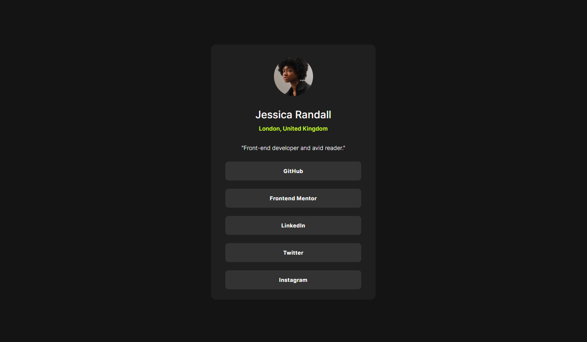

# Frontend Mentor - Social links profile solution

This is a solution to the [Social links profile challenge on Frontend Mentor](https://www.frontendmentor.io/challenges/social-links-profile-UG32l9m6dQ). 

## Table of contents

- [Overview](#overview)
  - [The challenge](#the-challenge)
  - [Screenshot](#screenshot)
  - [Links](#links)
- [My process](#my-process)
  - [Built with](#built-with)
  - [What I learned](#what-i-learned)
  - [Continued development](#continued-development)
  - [Useful resources](#useful-resources)
  - [AI Collaboration](#ai-collaboration)
- [Author](#author)

## Overview

### The challenge

Users should be able to:

- See hover, active, and focus states for all interactive elements on the page.

- See the social media buttons change their color when they are hovered, focused, or active.

### Screenshot

### Links

- Solution URL: [Add solution URL here](https://your-solution-url.com)
- Live Site URL: [Add live site URL here](https://hagrgharib.github.io/social-links-profile-main/)

## My process

### Built with

- Semantic HTML5 markup
- CSS custom properties
- Flexbox
- Mobile-first workflow
- External Style

### What I learned

- During this project, I learned and practiced several important concepts:

- BEM (Block, Element, Modifier) — I learned how to organize and name my CSS classes in a clear and maintainable way.

- CSS Custom Properties — I learned how to use :root and CSS variables to create reusable values, especially for colors.

- Planning CSS before coding — I learned how to think about the layout, spacing, sizing, and responsive behavior before writing the CSS instead of randomly changing properties until the design looks right.

- Writing CSS from scratch — I became more comfortable writing the styles myself and understanding why I use each CSS property.

- Semantic HTML — I learned more about using the right HTML elements based on their meaning and purpose instead of relying on 
 for everything.

- Mobile-first approach — I started by building the design for mobile screens first, then adapted it for larger screens using media queries.

- Responsive design — I practiced making the layout work well across different screen sizes, especially mobile and desktop.

### Continued development

- [Styled Components](https://styled-components.com/) - For styles

### AI Collaboration

- I used ChatGPT as a learning and review assistant during this project.

- I mainly used it to:

- Review and test my code and help me identify areas that could be improved.

- Get feedback on different approaches and understand which solution is better and why.

- Discuss CSS and HTML decisions and understand the reasoning behind them.

- Ask questions when I was unsure about the best way to implement something.

- What worked well was using AI to get a second opinion and understand the reasoning behind different solutions. I still wrote and implemented the code myself, while using AI to review my work and help me learn from my decisions.

## Author

- Frontend Mentor - [HAGRGHARIB](https://www.frontendmentor.io/profile/HAGRGHARIB)

